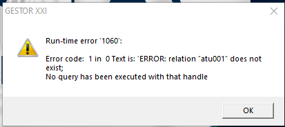

# Erro: atu001 does not exist tabela atu001 não existe
Backups recém atualizados normalmente vêm com a tabela atu001 faltando.
Ao restaurar uma base pode ser necessário criar a 
tabela de `atu001` que é a tabela de executáveis para atualizar.


> Mensagem de erro ao abrir sistema

Para resolver essa questão executar a seguinte SQLQuery na base que apresenta o erro:
```sql
CREATE TABLE public.atu001
(
  appnom character(20) NOT NULL,
  appdata timestamp without time zone,
  appbin bytea,
  CONSTRAINT atu001_pkey PRIMARY KEY (appnom)
)
WITH (
  OIDS=FALSE
);
ALTER TABLE public.atu001
  OWNER TO postgres;
```