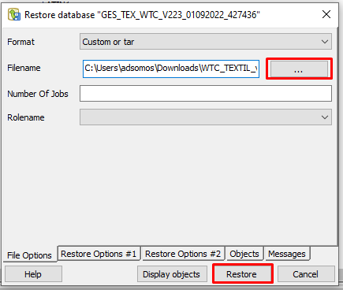

# Restaurar base de dados
Dentro do PGAdmin crie um novo database clicando com o lado direito em `Databases` e após em `New Database...`

Na janela que abriu insira o nome do banco de dados utilizando o seguinte padrão:
Cada termo separado por underline "`_`", termos:
- GES | Gestor;
- ESP ou TEX | Especialista ou Têxtil;
- Empresa;
- Versão do sistema;
- Data que o backup foi feito;
- Número do ticket que fez necessário a base.

Selecione a aba `Definition` e selecione as opções como a imagem a seguir:

Após isso confirme e localize o banco criado, clique com o lado direito nele e selecione `Restore...`

Na janela que abriu selecione o arquivo do backup clicando no botão `...` e após isso clique em `Restore`

