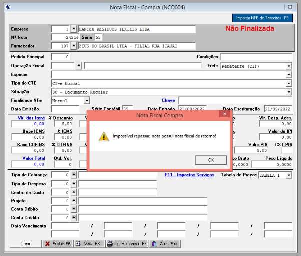

# Erro ao tentar adicionar nota de entrada

Cliente fez uma devolução ao fornecedor no VENDAS e depois APAGOU a 
nota de entrada que foi referenciada na nota de devolução, por isso
ao tentar adicinar a mesma nota ela informa o erro que a nota fiscla já possui 
nota fiscal de retorno, sendo que ela não consta em consulta do sistema.



Para ajustar é necessário no banco disvincular a nota da nota de venda para que 
seja feito a entrada do mesmo, posterior a entrada é necessário vincular novamente.
O método escolhido para resolver esse caso foi alterar a empresa da nota referenciada
dar entrada nota e depois voltar a referencia na nota de venda para a empresa correta.

```sql
/* 
    Primeiro mudando para uma outra empresa
*/
update co010 set nfeempcod = 2 where nfenum in (<Número da nota>, <Número da nota 2>...);

/* 
    Voltando a referencia para empresa correta
*/
update co010 set nfeempcod = 1 where nfenum in (<Número da nota>, <Número da nota 2>...);
```
> a tabela co010 é a tabela que guarda a informação de notas referenciadas.