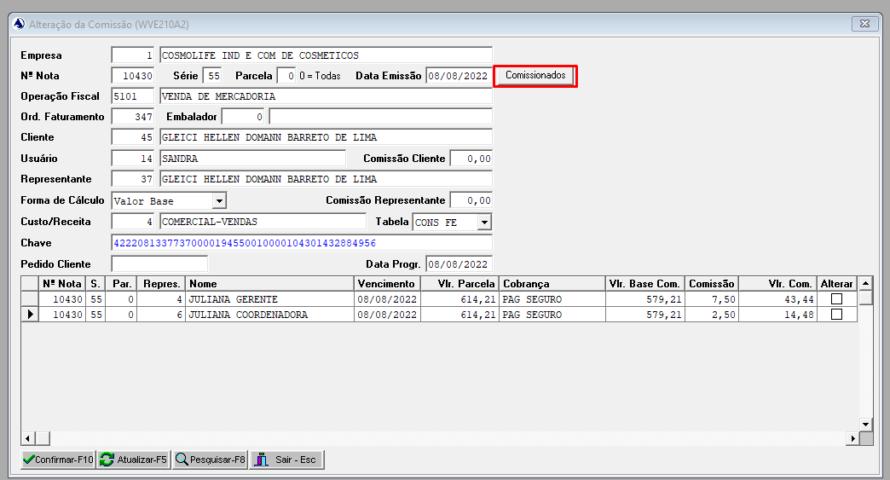
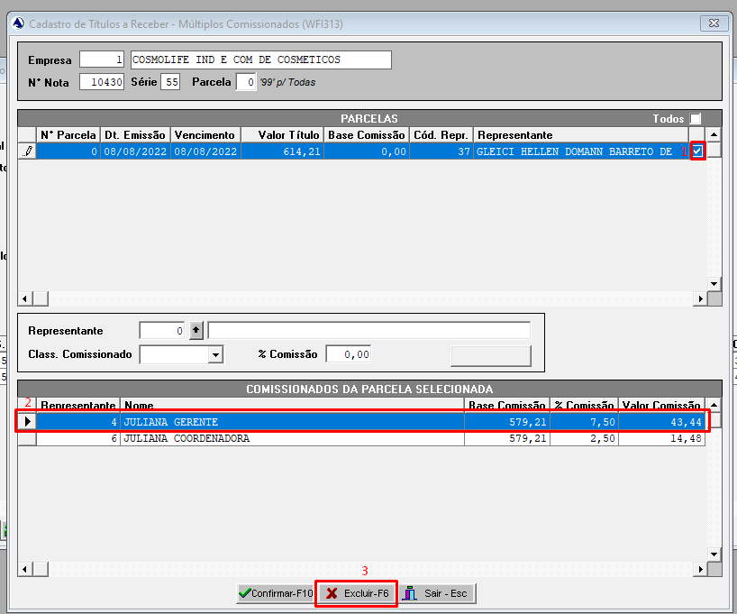
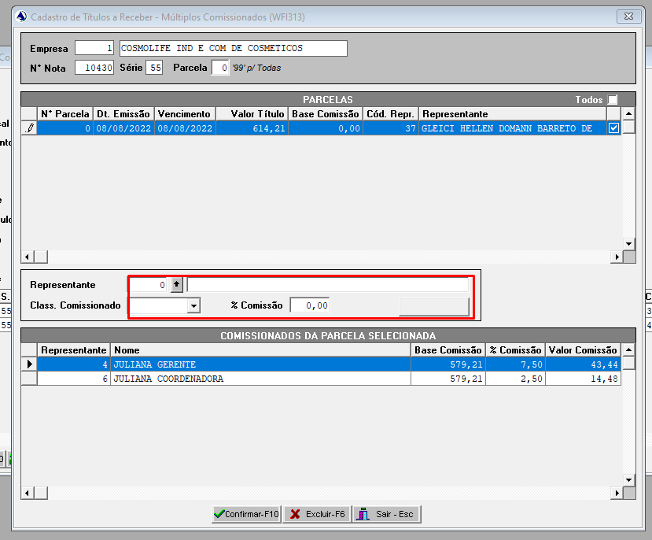
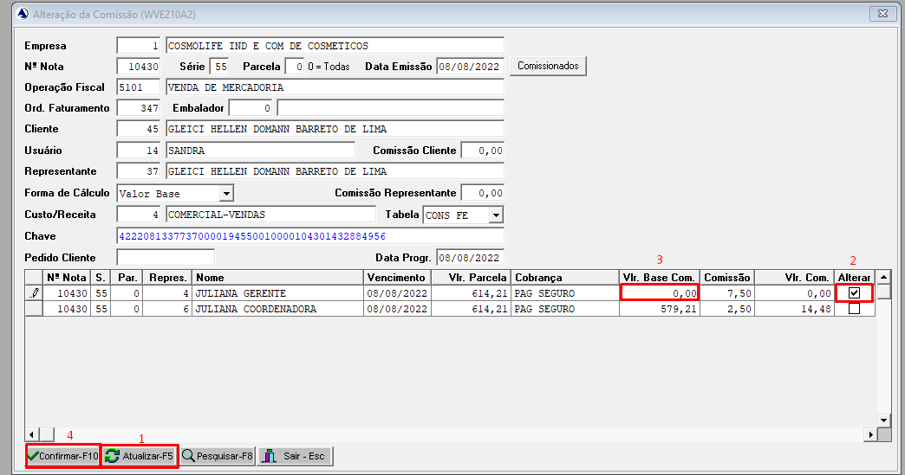

# Alterar múltiplos comissionados de uma Nota Fiscal | NF-e

Caminho:

> Para conseguir excluir um representante é necessário selecionar uma parcela

> Atualizar para aparecer a nova representante, inserir a base de comissão e selecionar a `hitbox Alterar` e confirmar as alterações.