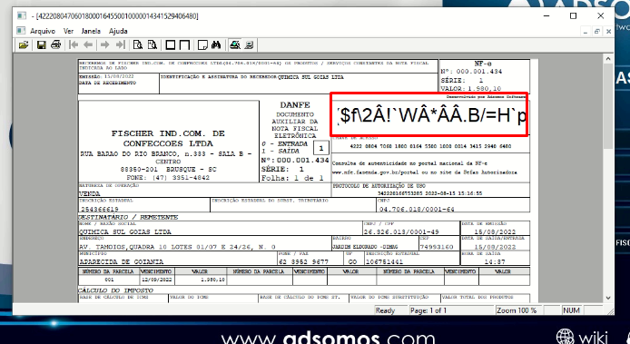
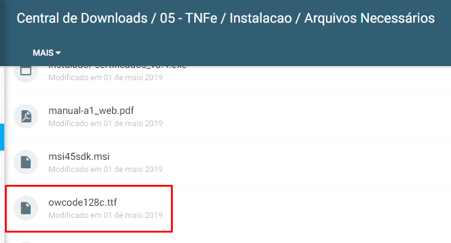

# Nota com caracteres estranhos no canto direito superior

Se a NF-e estiver desta forma, o sistema operacional da cliente não possui a 
fonte necessária para exibir o código de barras na NF-e.
Para baixar a fonte acesse:
[Link: Central de downloads](https://downloads.adsomos.com/ws-arquivos/05%20-%20TNFe/Instalacao/Arquivos%20Necess%C3%A1rios)
Portal de Downloads | 05 - TNFe | Instalacao | Arquivos Necessários
Localize o arquivo owcode128c.ttf.

Faça o download e instale a fonte.

Ou apenas mova para `C:/Windows/Fonts`.