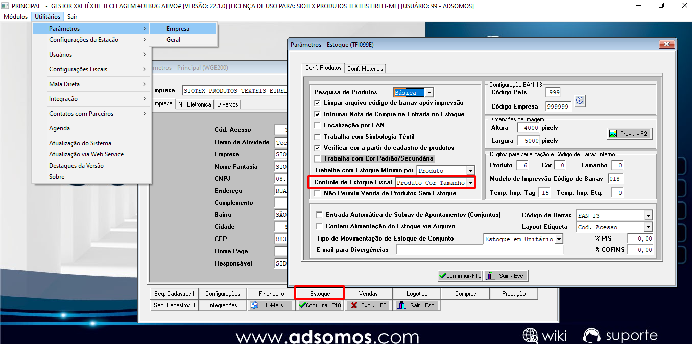
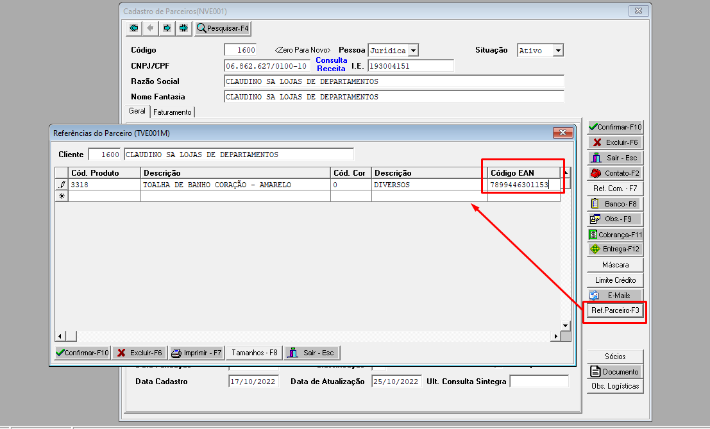
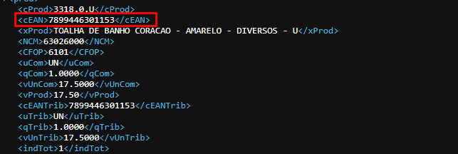

# Código de barras EAN GTIN sair no XML da nota fiscal

## Têxtil
Precisa alterar o contorle de estoque para `Produto-Cor-Tamanho`, conforme imagem

No cadastro do parceiro cliente precisa cadastrar todos os produtos com seu EAN `o mesmo precisa ser válido com 13 dígitos`

*XML:*
