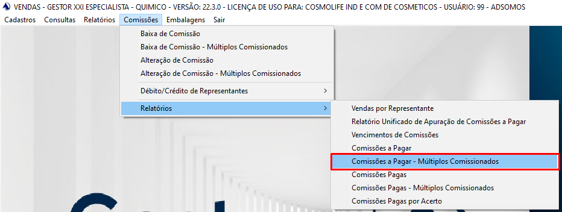

# Relatório de múltiplos comissionados

## Cosmolife
Cliente utiliza esse relatório para ver o quanto de comissão precisa pagar aos seus funcionários,
e para isso ela adiciona nas vendas as opções de múltiplos comissionados, sendo um comissionado ela mesma como coordenadora
e outro sendo a gerente da loja que foi realizado a venda. 
Caso haja divergencia no valor de coordenadora e gerentes no relatório, pode ser inserção incorretas nos comissionados.
Necessário localizar as notas que estão com esse problema e ajustá-las manualmente.