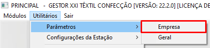
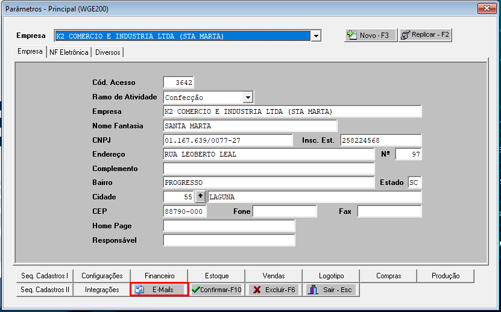
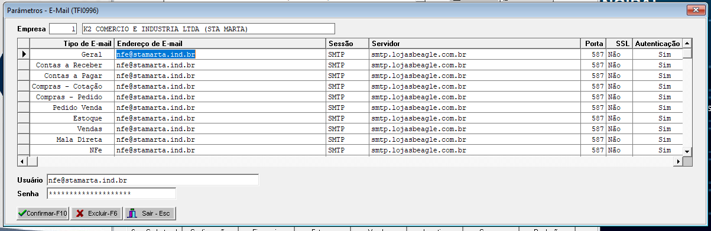
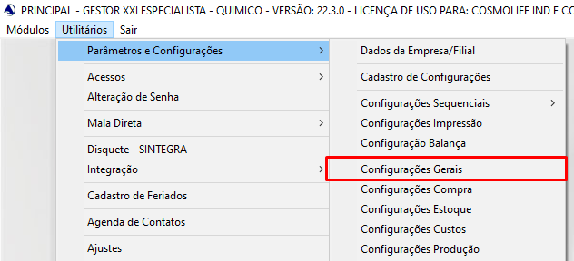

# Alterar e-mail que envia Nota Fiscal Eletrônica NF-e
Se o e-mail for `Gmail`, é necessário realizar uma validação nas configurações da conta, 
e uma senha especifica para uso de serviços como o disparador de e-mail do sistema Gestor.

[Link: Validação para contas Gmail](https://wiki.adsomos.com/bin/view/Base%20de%20Conhecimento/Gerentec%206.0/%E2%9C%A9%20NOVIDADES/Vers%C3%A3o%2093/E-Mail/Nova%20valida%C3%A7%C3%A3o%20Gmail/?srid=djcsEnm2)

Problema de conexão com o servidor de envio, quando o host do e-mail for da empresa, 
é responsabilidade da mesma verificar.

## Textil
Principal | Utilitários | Parâmetros | Empresa | Emails(Botão)

> Configuração de rede e senha tem que ser disponibilizado pela empresa para realização desse procedimento.

## Especialista
Principal | Utilitários | Parâmetros e configurações | Configurações gerais | Página II

