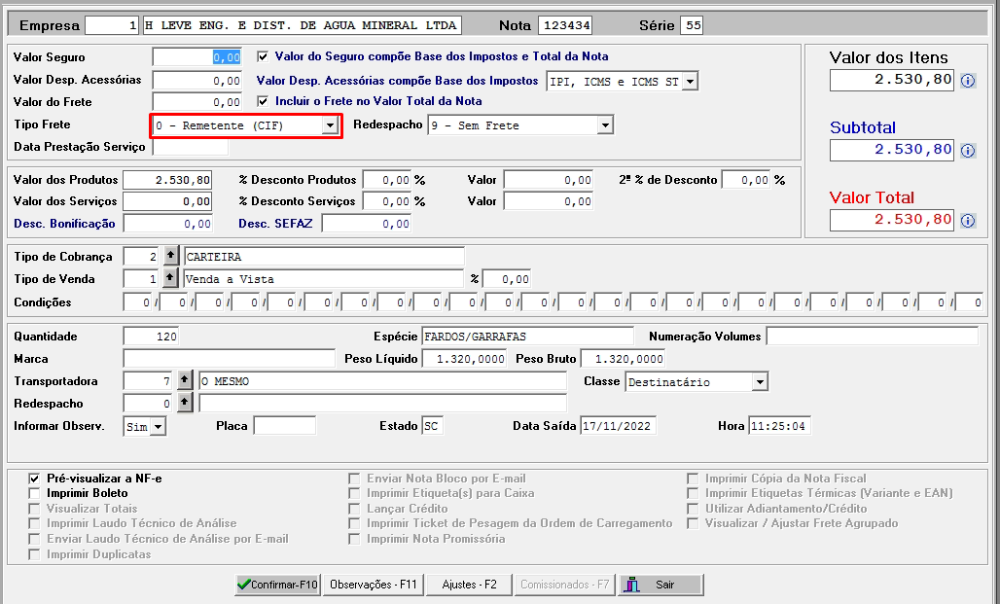
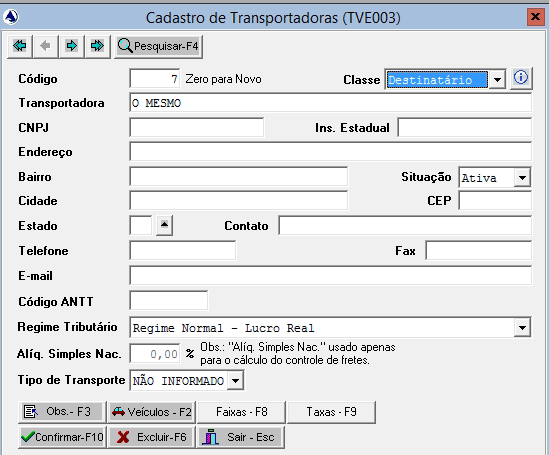

# Transportadora NF-e

é preciso colocar a transportadora coringa conforme 
Boa Tarde.
Para solução do problema de rejeição da Modalidade do Frete x Dados do Transportador:

Pode ser utilizado a "Classe" da Transportadora.
Deve ser cadastrado duas transportadoras "Coringas" para 
representar Respectivamente o Emitente e o Destinatário.
Conforme a Modalidade do Frete informado, deve ser indicado uma 
transportadora condizente com a operação, para que sejam geradas as 
informações nas TAGs (pegando da Transportadora, do 
Destinatário ou da Empresa Emitente).